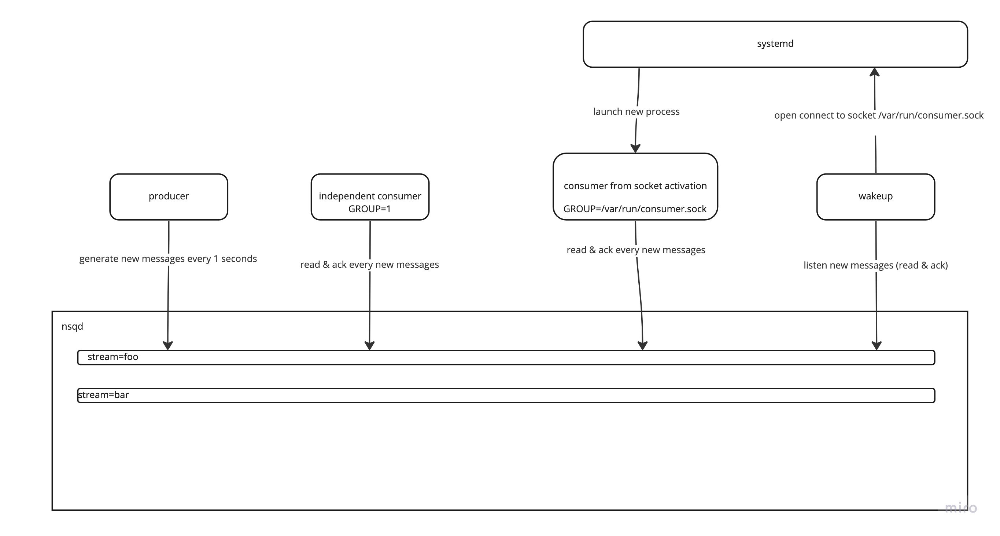

## How to prepare

Start redis in docker

```bash
make up
```

## Architecture



## Run producer

```bash
STREAM=foo make producer
```

Events will be generated to the stream `foo`

## Run consumers with different groups

```bash
STREAM=foo GROUP=1 make consumer
STREAM=foo GROUP=2 make consumer
```

Each consumer will receive the same events from the stream `foo`.
We will try to use 1-1 mapping between group and consumer, in that case
each consumer can ack message regardless how to use other consumers. 
More - https://redis.io/docs/data-types/streams-tutorial/#consumer-groups

## Run consumers with the same group

```bash
STREAM=foo GROUP=1 make consumer
STREAM=foo GROUP=1 make consumer
```

Each consumer will receive different events from the stream `foo`.
Pretty close how to load balancer works in round-robin mode.

## Run consumers with the same group with timeout

```bash
STREAM=foo GROUP=1 TIMEOUT=30 make consumer
```

Consumer will wait new messages for 30 seconds. If no messages will be received, consumer will exit.

## Run socket activation (systemd) consumer for development

It uses systemd-socket-activate to listen on a socket and launch consumer when new data arriving in socket.

```bash
STREAM=foo TIMEOUT=30 make systemd-socket-activate-consumer
```

Starts the consumer with systemd socket activation. The consumer will be started by systemd when a new data is received
on the socket `/var/run/sa-consumer.sock`.

## Run wakeup service

Subscribe for new messages and send wakeup signal (open connect to socket) to the consumer.

```bash
make wakeup
```

Under the hood it collects all streams and their groups from redis streams, checks the name of group for valid socket file type.
If it exists -> using it for further wakeup if new messages in stream will appear.

## Run with systemd

```bash
make reload-systemd-consumer
systemctl enable mqueue-consumer.socket
systemctl enable mqueue-consumer.service
systemctl start mqueue-consumer.socket
make wakeup
```

Services are ready to receive new messages, to generate a new one - run producer.

Show logs of consumer:

```bash
journalctl -u mq-consumer.service
```
